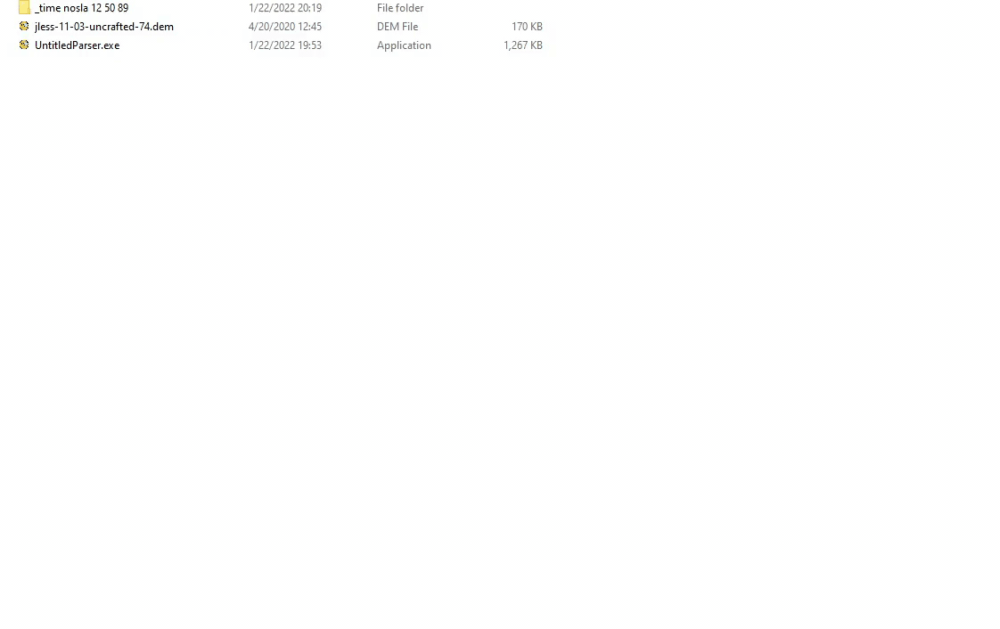

# Untitled Parser

A parser for source engine demos similar to [listdemo+](https://www.speedrun.com/portal/resources "portal resources"). Mainly used to time individual demos or entire speeruns, but can be used to extract other information from demos. In addition, there is built-in flag detection which can be useful for segmented runs (ticks which have `#FLAGS#` echoed will get displayed). To time demos, simply drag a demo or a folder of demos over the [application](https://github.com/UncraftedName/UncraftedDemoParser/releases "releases"). You can also set it as the default application to open .dem files.



Here is a (mostly accurate) list of all supported games/versions and what features are supported.

| Game | Basic<br/>Timing | Timing<br/>adjustment | Net-Message<br/>Parsing | Entity<br/>Parsing | Sound<br/>Parsing | 
| ------------------- | :-: | :-: | :-: | :-: | :-: |
| HL2 OE              | ✅ | ❌ | 🔶 | ❌ | ❌ |
| Portal 1 3420, 5135 | ✅ | ✅ | ✅ | ✅ | ✅ |
| Portal 1 steampipe  | ✅ | ✅ | 🔶 | ❌ | ✅ |
| Team Fortress 2     | ❌ | ❌ | 🔶 | ❌ | ✅ |
| Portal 2            | ✅ | ✅ | 🔶 | 🔶 | 🔶 |
| L4D1 1005,1040      | ✅ | ❌ | 🔶 | ❌ | ❌ |
| L4D2 2000-2220      | ✅ | ❌ | 🔶 | ❌ | ❌ |

Additionally, HL2 is supported for all the same versions as Portal 1 with some small caveats. Timing is supported for the following Portal 1 mods (mostly for 3420/5135): gamma energy, rexaura, TFV, portal unity, portal pro, portal prelude, portal elevators, and CBoRRR. If you would like support for another game and/or mod, you can message me or preferably open a new issue.

There are more features than just timing demos, you can use `--help` to learn how to use them. If you're just curious about what exactly is in a demo, use `--demo-dump`; that will print everything that was parsed in the demo to a text file.


Note that many of these more advanced features are only supported for some games/versions, and the primary usage is currently designed for Portal 1.

## Building and Coding

This project uses .NET 7.0. To build the project, just build the solution with Visual Studio or MSBuild. If you build a release build, all the assemblies get merged into one .exe which is easy to just send people or whatever (thanks mike). There is a pre-build step which runs some git commands to save the info used for the `--version` option, so as long as the repo has been cloned and you have a recent version of git that should work alright.

There isn't an API or even any extensive documentation, and demos can be pretty darn complicated sometimes. If you want to get some information from them your best bet is to start digging through the code, or feel free to get in touch with me. The `--demo-dump` option will create a text file which contains a human readable representation of everything I know how to parse in the given demo, this is a good way to start digging for stuff.

Here's an example to get the player position on every tick:

<details>
<summary>Click to expand</summary>
	
```cs
SourceDemo demo = new SourceDemo("oob.dem");
demo.Parse();
demo.FilterForPacket<Packet>()
    .Select(packet => (packet.Tick, locationInfo: packet.PacketInfo[0]))
    .ToList()
    .ForEach(tuple => {
        Console.WriteLine($"[{tuple.Tick}]");
        Console.WriteLine(tuple.locationInfo.ToString());
    });
```
```
...
[833]
flags: None
view origin:           -1562.41 ,      28.16 ,    3185.22
view angles:              65.97°,    -106.41°,       0.00°
local view angles:        65.97°,    -106.41°,       0.00°
view origin 2:             0.00 ,       0.00 ,       0.00
view angles 2:             0.00°,       0.00°,       0.00°
local view angles 2:       0.00°,       0.00°,       0.00°

[834]
flags: None
view origin:           -1562.66 ,      26.84 ,    3178.59
view angles:              63.72°,    -107.66°,       0.00°
local view angles:        63.72°,    -107.66°,       0.00°
view origin 2:             0.00 ,       0.00 ,       0.00
view angles 2:             0.00°,       0.00°,       0.00°
local view angles 2:       0.00°,       0.00°,       0.00°

[835]
flags: None
view origin:           -1562.88 ,      25.66 ,    3172.66
view angles:              62.07°,    -108.79°,       0.00°
local view angles:        62.07°,    -108.79°,       0.00°
view origin 2:             0.00 ,       0.00 ,       0.00
view angles 2:             0.00°,       0.00°,       0.00°
local view angles 2:       0.00°,       0.00°,       0.00°
...
```
</details>

Here's an example to get all ticks where the forward key was pressed:

<details>
<summary>Click to expand</summary>
    
```cs
SourceDemo demo = new SourceDemo("why-are-there-so-many-bees.dem");
demo.Parse();
demo.FilterForPacket<UserCmd>()
    .Where(userCmd => userCmd.Buttons != null && (userCmd.Buttons & Buttons.Forward) != 0)
    .ToList()
    .ForEach(userCmd => Console.WriteLine(userCmd.Tick));
```
```
...
291
292
293
317
318
319
...
```
</details>

Here's a more complicated example to get the fov of demos where the fov was set while the demo was recording (if it was set before, a similar search might need to be done in the InstanceBaseline in the StringTables):

<details>
    <summary>Click to expand</summary>

First, parse the demo.

```cs
SourceDemo demo = new SourceDemo("fov-change-middemo.dem");
demo.Parse();
```

Using lambda expressions:
```cs
demo.FilterForMessage<SvcPacketEntities>()
    .SelectMany(tuple => tuple.message.Updates.OfType<Delta>(), (tuple, delta) => new {tuple.tick, delta})
    .Where(tuple => tuple.delta.EntIndex == 1) // filter for player
    .SelectMany(tuple => tuple.delta.Props, (tuple, propInfo) => new {tuple.tick, propInfo})
    .Where(tuple => tuple.propInfo.prop.Name == "m_iDefaultFOV")
    .Select(tuple => new {Tick = tuple.tick, FovValue = ((SingleEntProp<int>)tuple.propInfo.prop).Value})
    .ToList()
    .ForEach(Console.WriteLine);
```

Using query expressions:
```cs
var fovValues = 
    from messageTup in demo.FilterForMessage<SvcPacketEntities>()
    from delta in messageTup.message.Updates.OfType<Delta>()
    where delta.EntIndex == 1
    from propInfo in delta.Props
    where propInfo.prop is IntEntProp intProp && intProp.Name == "m_iDefaultFOV"
    select new {Tick = messageTup.tick, FovValue = ((SingleEntProp<int>)propInfo.prop).Value};

foreach (var value in fovValues)
    Console.WriteLine(value);
```

Using loops:
```cs
foreach ((SvcPacketEntities message, int tick) in demo.FilterForMessage<SvcPacketEntities>()) {
    foreach (EntityUpdate entityUpdate in message.Updates) {
        // check if the update is of type delta, if it is check if the entity index is 1 (player)
        if (entityUpdate is Delta delta && delta.EntIndex == 1) {
            foreach ((_, EntityProperty entityProperty) in delta.Props) {
                // check if the prop is an int, then check the name (can be found in the DataTables packet)
                if (entityProperty is SingleEntProp<int> intProp && intProp.Name == "m_iDefaultFOV") {
                    Console.WriteLine(new {tick, intProp.Value});
                    goto end;
                }
            }
        }
    }
    end:;
}
```

```
{ Tick = 374, FovValue = 70 }
{ Tick = 507, FovValue = 5 }
{ Tick = 759, FovValue = 200 }
{ Tick = 1119, FovValue = 140 }
{ Tick = 2428, FovValue = 90 }
```

More complicated stuff like entity-related properties or NET/SVC messages will probably only work for some versions of portal 1 and sometimes for portal 2, and I only 100% guarantee pinky promise you that it will work for portal 3420. In general, to find certain values you'll either need to dig deep into the code or ask me where to find them. Dumping the entire demo to a text file using `--demo-dump` is a good way to explore where various fields can be found.
</details>

Finally, here's an example of how to use some of the existing features of the application:
<details>
<summary>Click to expand</summary>

First, parse the demo.
```cs
SourceDemo demo = new SourceDemo("you wont believe whats in this file.dem");
demo.Parse();
```

Finding teleports (currently only supported for Portal 1):
```cs
OptTeleports.FindTeleports(demo, OptTeleports.FilterFlags.VerboseInfo)
	.ToList()
	.ForEach(tuple => {
        Console.WriteLine($"[{tuple.tick}]");
        Console.WriteLine(tuple.userMessage.ToString());
    });
```
```
[1692]
portal: {ent index: 23, serial: 397}
portalled: {ent index: 1, serial: 658}
new position: <-531.065, -396.938, 365.823>
new angles: <45.949°, 212.396°, 37.941°>
[1985]
portal: {ent index: 70, serial: 846}
portalled: {ent index: 397, serial: 208}
new position: <-476.195, -375.380, 187.801>
new angles: <0.000°, 90.000°, 360.000°>
[2191]
portal: {ent index: 23, serial: 397}
portalled: {ent index: 397, serial: 208}
new position: <189.178, -744.428, 201.997>
new angles: <0.000°, 180.000°, 360.000°>
```

Removing captions:
```cs
FileStream outStream = new FileStream("no-captions.dem", FileMode.Create);
OptRemoveCaptions.RemoveCaptions(demo, outStream);
```
</details>


## Other parsers and resources that I used
- https://github.com/NeKzor/sdp.js 
- https://nekzor.github.io/dem#netsvc-message <-- useful for a high level overview
- https://github.com/StatsHelix/demoinfo
- https://github.com/VSES/SourceEngine2007
- https://github.com/alliedmodders/hl2sdk
- https://github.com/iVerb1/SourceLiveTimer
- https://github.com/Traderain/VolvoWrench
