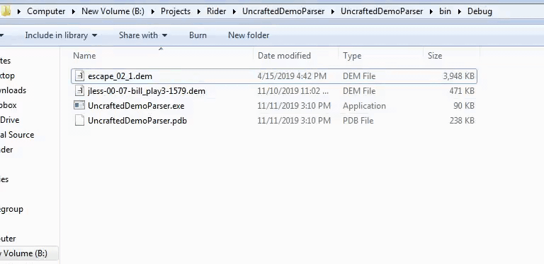

# Untitled Demo Parser

## What is this?

This is a parser for source engine demos similar to listdemo+. Currently it explicitly supports Portal 1 Unpack, Portal 1 Steampipe, Portal 1 3420/leak, Portal 2, some version(s) of L4D2, and HL2 (new engine I think). If you would like support for another version and/or game, you can message me or preferably open a new issue. I plan to add support for all versions of L4D2 and L4D1 in the future.

## Why should I use this?

This can be used to time individual demos like listdemo+ or entire runs. In addition, it has some mod support (currently only for portal 1) which only a couple of other timers partially support. For segmented runs the parser can detect more flags than just `#SAVE#` which can be useful for custom timing. As long as your flag has no spaces and is surround by `#` then the parser should detect it.

<p align="center">
  
</p>

## How do I use this?

Go to the releases tab and download the most recent exe (windows might say it's a virus or something). Currently it is only a console application and there is no GUI. To use it you can drag a demo over it or an entire folder from a run.
 \
Similarly, you can also set the parser as the default application to open .dem files instead of listdemo+. You can also do all of this and more complicated stuff from the console to get more juicy information from demos.

 \
You can use `--help` to get more information on the usage. If you're just curious about what exactly is in a demo, use `-v`; that will print a full verbose dump of everything that was parsed in the file.

## How do I code with it?

Get netcore v3.1. To build the project you can use use the .bat in the ConsoleApp project to create a release build. See https://docs.microsoft.com/en-us/dotnet/core/deploying/deploy-with-cli for more details. I don't have an API set up for the parser because I'm still making a lot of changes to a lot of the core code very frequently; unfortunately, demos are pretty darn complicated and not documented anywhere. If you would like to learn more about how to extract information from them, feel free to get in touch with me. 

Here's an example to get the player position on every tick:

<details>
    <summary>Click to expand</summary>
	
```cs
SourceDemo demo = new SourceDemo("oob.dem");
demo.Parse();
demo.FilterForPacket<Packet>()
    .Select(packet => (packet.Tick, locationInfo: packet.PacketInfo[0]))
    .ToList()
    .ForEach(tuple => {
        Console.WriteLine($"[{tuple.Tick}]");
        Console.WriteLine(tuple.locationInfo.ToString());
    });
```
```
...
[833]
flags: None
view origin:           -1562.41 ,      28.16 ,    3185.22
view angles:              65.97°,    -106.41°,       0.00°
local view angles:        65.97°,    -106.41°,       0.00°
view origin 2:             0.00 ,       0.00 ,       0.00
view angles 2:             0.00°,       0.00°,       0.00°
local view angles 2:       0.00°,       0.00°,       0.00°

[834]
flags: None
view origin:           -1562.66 ,      26.84 ,    3178.59
view angles:              63.72°,    -107.66°,       0.00°
local view angles:        63.72°,    -107.66°,       0.00°
view origin 2:             0.00 ,       0.00 ,       0.00
view angles 2:             0.00°,       0.00°,       0.00°
local view angles 2:       0.00°,       0.00°,       0.00°

[835]
flags: None
view origin:           -1562.88 ,      25.66 ,    3172.66
view angles:              62.07°,    -108.79°,       0.00°
local view angles:        62.07°,    -108.79°,       0.00°
view origin 2:             0.00 ,       0.00 ,       0.00
view angles 2:             0.00°,       0.00°,       0.00°
local view angles 2:       0.00°,       0.00°,       0.00°
...
```
</details>

Here's an example to get all ticks where the forward key was pressed:

<details>
    <summary>Click to expand</summary>
    
```cs
SourceDemo demo = new SourceDemo("oob.dem");
demo.Parse();
demo.FilterForPacket<UserCmd>()
    .Where(userCmd => userCmd.Buttons != null && (userCmd.Buttons & Buttons.Forward) != 0)
    .ToList()
    .ForEach(userCmd => Console.WriteLine(userCmd.Tick));
```
```
...
291
292
293
317
318
319
...
```
</details>

And finally, here's a more complicated example to get the fov of demos where the fov was set while the demo was recording (if it was set before, a similar search might need to be done in the InstanceBaseline in the StringTables):

<details>
    <summary>Click to expand</summary>

First, parse the demo.
```cs
SourceDemo demo = new SourceDemo("fov-change-middemo.dem");
demo.Parse();
```

Using lambda expressions:
```cs
demo.FilterForMessage<SvcPacketEntities>()
    .SelectMany(tuple => tuple.message.Updates.OfType<Delta>(), (tuple, delta) => new {tuple.tick, delta})
    .Where(tuple => tuple.delta.EntIndex == 1) // filter for player
    .SelectMany(tuple => tuple.delta.Props, (tuple, propInfo) => new {tuple.tick, propInfo})
    .Where(tuple => tuple.propInfo.prop.Name == "m_iDefaultFOV")
    .Select(tuple => new {
        Tick = tuple.tick,
        FovValue = ((IntEntProp)tuple.propInfo.prop).Value
    })
    .ToList()
    .ForEach(Console.WriteLine);
```

Using query expressions:
```cs
var fovValues = 
    from messageTup in demo.FilterForMessage<SvcPacketEntities>()
    from delta in messageTup.message.Updates.OfType<Delta>()
    where delta.EntIndex == 1
    from propInfo in delta.Props
    where propInfo.prop is IntEntProp intProp && intProp.Name == "m_iDefaultFOV"
    select new {Tick = messageTup.tick, FovValue = ((IntEntProp)propInfo.prop).Value};

foreach (var value in fovValues)
    Console.WriteLine(value);
```

Using loops:
```cs
foreach ((SvcPacketEntities message, int tick) in demo.FilterForMessage<SvcPacketEntities>()) {
    foreach (EntityUpdate entityUpdate in message.Updates) {
        // check if the update is of type delta, if it is check if the entity index is 1 (player)
        if (entityUpdate is Delta delta && delta.EntIndex == 1) {
            foreach ((_, EntityProperty entityProperty) in delta.Props) {
                // check if the prop is an int, then check the name (can be found in the DataTables packet)
                if (entityProperty is IntEntProp intProp && intProp.Name == "m_iDefaultFOV") {
                    Console.WriteLine(new {tick, intProp.Value});
                    goto end;
                }
            }
        }
    }
    end:;
}
```

```
{ Tick = 374, FovValue = 70 }
{ Tick = 507, FovValue = 5 }
{ Tick = 759, FovValue = 200 }
{ Tick = 1119, FovValue = 140 }
{ Tick = 2428, FovValue = 90 }
```
</details>

More complicated stuff like this with entity-related properties will only work for portal 1 right now, and I only 100% guarantee pinky promise you that it will work for portal 3420. In general, to find certain values you'll either need to dig deep into the code or ask me where to find them.

## Other parsers and resources that I used
- https://github.com/NeKzor/sdp.js 
- https://nekzor.github.io/dem#netsvc-message <-- useful for a high level overview
- https://github.com/StatsHelix/demoinfo
- https://github.com/VSES/SourceEngine2007
- https://github.com/alliedmodders/hl2sdk
- https://github.com/iVerb1/SourceLiveTimer
